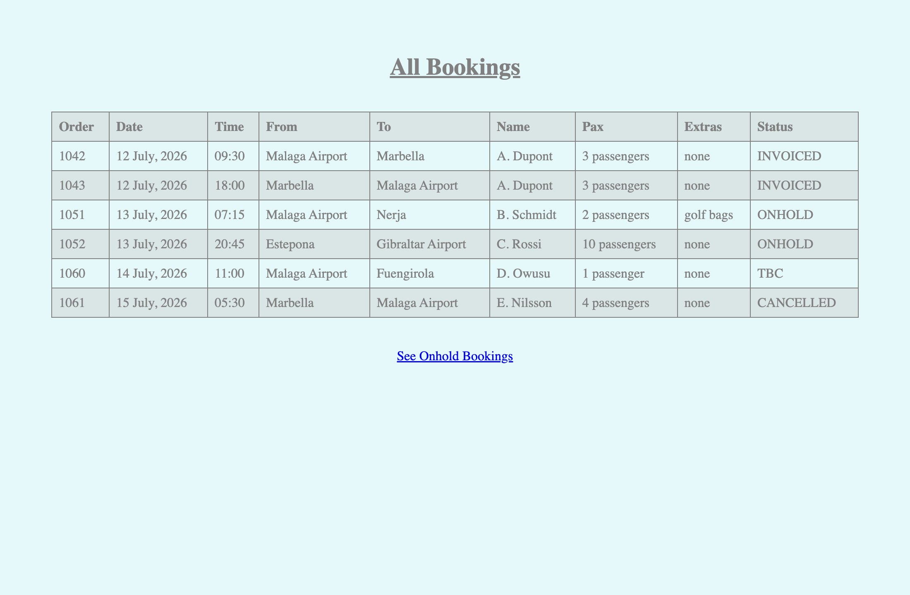
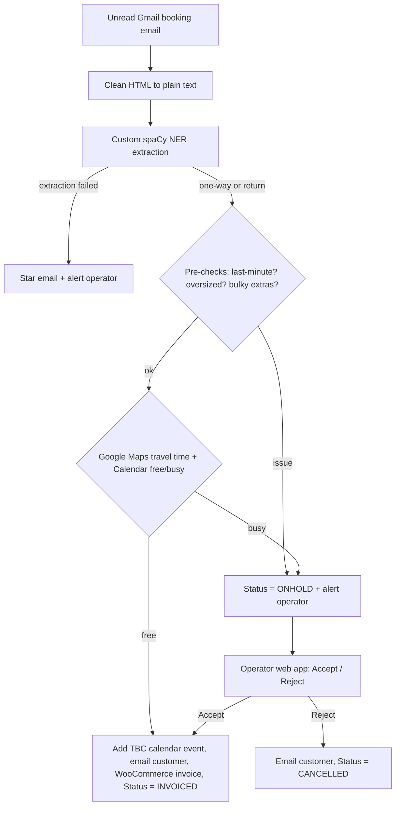
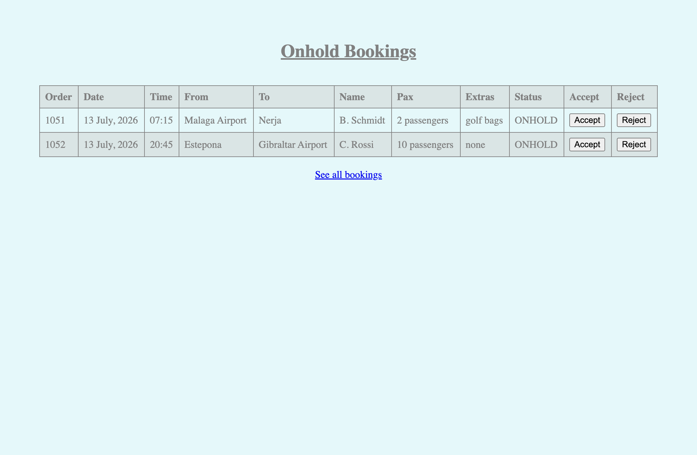

# Auto-Admin System for a Transfer Company

> Turns booking-request emails into confirmed, invoiced calendar bookings,
> automatically, with a human in the loop only when a booking needs checking.

A real automation built for a private airport-transfer company. Incoming booking
emails are parsed with a custom NER model, checked for availability against
Google Calendar and Google Maps travel times, then either auto-confirmed
(calendar event + invoice + customer reply) or parked as **on-hold** for the
operator to accept or reject from a small web app.



---

## English

### The problem
A small transfer company was handling every booking enquiry by hand: reading the
email, working out travel time, checking the calendar for a clash, replying to
the customer, raising the invoice, and adding the job to the calendar. Slow,
repetitive, and easy to get wrong at 2am.

### What it does
- Polls Gmail every 10 minutes for unread booking-request emails.
- Extracts the booking fields (order, name, date, time, pickup, destination,
  pax, price, deposit, extras...) with a **custom spaCy NER model**.
- Calculates the required transfer time with the **Google Maps** API and checks
  the **Google Calendar** for a free slot (covering the return leg).
- **Auto-confirms** when clear: adds a calendar event, emails the customer, and
  raises the WooCommerce invoice via Selenium.
- **Parks as on-hold** when the booking is last-minute, oversized, has bulky
  extras, or clashes, and pushes a phone alert to the operator.
- Lets the operator **Accept / Reject** on-hold bookings from a Flask web app.
- Stores every booking and its status in a MySQL database; handles both one-way
  and return trips.

### Architecture



### Web app
The operator sees all bookings and a filtered on-hold view with Accept / Reject
buttons. Accepting confirms and invoices the booking; rejecting cancels it and
emails the customer.

| All bookings | On-hold review |
| --- | --- |
|  |  |

### Try the demo (no credentials needed)
The production app needs Gmail, Calendar, Maps, MySQL and WordPress access, so it
cannot be hosted publicly. A self-contained demo recreates the operator web UI
with an in-memory SQLite database of synthetic bookings:

```bash
cd app
python3 -m pip install flask
python3 demo_app.py
# open http://127.0.0.1:5000   (login: demo / demo)
```

You can browse the bookings, open the on-hold view, and Accept / Reject bookings
to watch their status change.

### Running the full system
1. `cd app && pip install -r requirements.txt`
2. Copy `.env.example` to `.env` and fill in the values.
3. Provide a Google service-account key file (default name `admin-auth.json`,
   override with `SERVICE_AUTH_FILE`) and a `GMaps_api.txt` Maps key.
4. Train/supply the spaCy NER model (`model-best-gpu`); see
   `NER model creation.ipynb`.
5. Schedule `scheduled_auto_admin.py` every 10 minutes (see `app/crontab`).

### Project structure
```
app/
  app.py                   Flask web app (operator login, bookings, on-hold)
  demo_app.py              Self-contained SQLite demo of the web UI
  scheduled_auto_admin.py  Cron entry point - runs the pipeline every 10 min
  health_check.py          Daily site health check + alert
  functions.py             Backwards-compatible facade re-exporting the modules
  db.py                    Database connection + booking CRUD
  email_service.py         Gmail: fetch, label, reply
  ner_extraction.py        Custom NER -> structured booking fields
  routing.py               Google Maps travel time
  calendar_service.py      Google Calendar free/busy + event creation
  invoicing.py             WooCommerce invoice via Selenium
  notifications.py         Pushover phone alerts
  booking_logic.py         Orchestration (one-way / return / accept / reject)
  logging_config.py        Shared logger
  templates/  static/      Flask templates and CSS
NER model creation.ipynb   Steps to build the custom NER model
```

### Tech stack
Python, Flask, spaCy (custom NER), Google Gmail & Calendar APIs, Google Maps API,
Selenium (WooCommerce), MySQL/MariaDB, Pushover.

### What I would do differently today
- Replace the custom NER model with an LLM extraction call returning structured
  JSON: far less data labelling, more robust to varied email phrasing.
- Swap Selenium invoicing for the WooCommerce REST API (no brittle XPath UI driving).
- Add automated tests around the booking-decision logic and a proper config layer.
- Containerise and run as a queue-driven worker rather than a cron poll.

> Note: this is a portfolio copy. Email/calendar templates and route
> abbreviations are intentionally redacted, and no real credentials are included.

---

## Français

### Le problème
Une petite société de transferts traitait chaque demande de réservation à la
main : lire l'e-mail, estimer le temps de trajet, vérifier le calendrier, répondre
au client, établir la facture et ajouter la course au calendrier. Lent, répétitif
et source d'erreurs.

### Ce que fait le système
- Vérifie Gmail toutes les 10 minutes pour les demandes de réservation non lues.
- Extrait les champs de la réservation (numéro, nom, date, heure, départ,
  destination, passagers, prix, acompte, extras...) avec un **modèle NER spaCy
  sur mesure**.
- Calcule le temps de trajet via l'API **Google Maps** et vérifie la
  disponibilité dans **Google Calendar** (en tenant compte du trajet retour).
- **Confirme automatiquement** quand tout est libre : événement agenda, e-mail au
  client et facture WooCommerce via Selenium.
- **Met en attente** si la demande est de dernière minute, surdimensionnée, avec
  des extras encombrants ou en conflit, et envoie une alerte sur le téléphone de
  l'exploitant.
- Permet à l'exploitant d'**Accepter / Refuser** les réservations en attente via
  une application web Flask.
- Enregistre chaque réservation et son statut dans une base MySQL ; gère les
  trajets aller simple et aller-retour.

### Architecture
Voir le schéma dans la section anglaise ci-dessus (e-mail -> extraction NER ->
vérifications -> Maps/Calendar -> confirmation automatique ou mise en attente ->
validation par l'exploitant).

### Essayer la démo (sans identifiants)
L'application réelle nécessite des accès Gmail, Calendar, Maps, MySQL et
WordPress : elle ne peut donc pas être hébergée publiquement. Une démo autonome
recrée l'interface de l'exploitant avec une base SQLite en mémoire et des
réservations fictives :

```bash
cd app
python3 -m pip install flask
python3 demo_app.py
# ouvrez http://127.0.0.1:5000   (identifiants : demo / demo)
```

### Structure du projet et stack technique
Voir la section anglaise. Stack : Python, Flask, spaCy (NER sur mesure), APIs
Google Gmail/Calendar, API Google Maps, Selenium (WooCommerce), MySQL/MariaDB,
Pushover.

### Ce que je ferais différemment aujourd'hui
- Remplacer le modèle NER par une extraction via LLM renvoyant du JSON structuré.
- Remplacer Selenium par l'API REST de WooCommerce.
- Ajouter des tests automatisés sur la logique de décision et une vraie couche de
  configuration.
- Conteneuriser et fonctionner via une file d'attente plutôt qu'un cron.

> Remarque : ceci est une copie portfolio. Les modèles d'e-mails et les
> abréviations d'itinéraires sont volontairement masqués, et aucun identifiant
> réel n'est inclus.

## License
[MIT](LICENSE)
